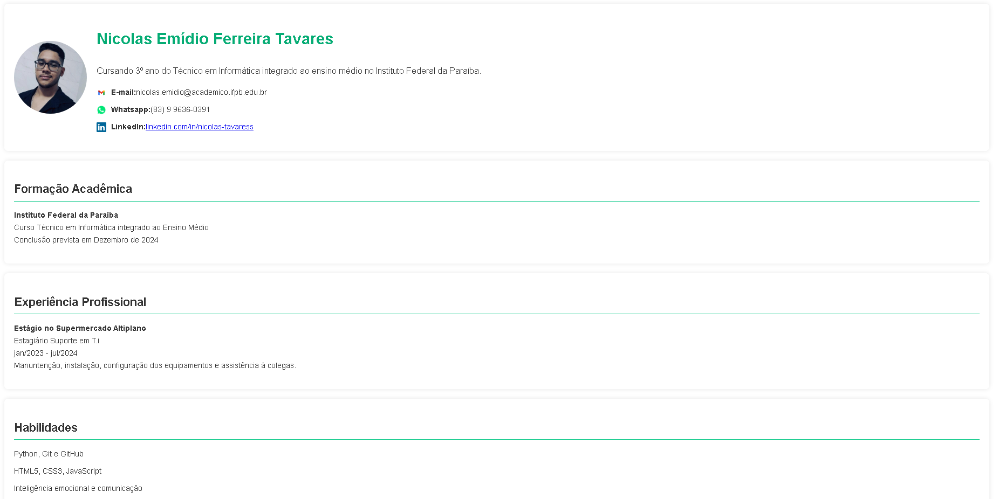

# Currículo Pessoal - HTML e CSS

Este projeto é um currículo pessoal desenvolvido utilizando **HTML5** e **CSS3**, com o objetivo de criar um documento profissional e estiloso, ideal para ser enviado em processos seletivos.

## 📄 Estrutura do Projeto

O projeto é composto por dois arquivos principais:

- **index.html**: Contém a estrutura semântica do currículo.
- **estilo.css**: Responsável por toda a estilização da página.

## 🛠️ Tecnologias Utilizadas

- **HTML5**: Para a marcação semântica do currículo, garantindo acessibilidade e boa prática.
- **CSS3**: Utilizado para a personalização do design, com cores alternadas, tabelas estilizadas, e imagem de fundo.

## 📁 Estrutura de Arquivos

/curriculo/ │ ├── /imagens/ │ ├── perfil.png # Imagem de perfil usada no currículo │ ├── mail.png # Ícone de e-mail │ ├── whatsapp.png # Ícone do WhatsApp │ ├── linkedin.png # Ícone do LinkedIn │ └── background.jpg # Imagem de fundo do currículo │ ├── index.html # Arquivo principal com a estrutura HTML do currículo ├── estilo.css # Arquivo CSS contendo o design do currículo └── README.md # Documentação do projeto

## 📑 Seções do Currículo

1. **Perfil**: Apresenta a foto de perfil, nome, uma breve descrição pessoal e contatos (e-mail, WhatsApp, LinkedIn).
2. **Formação Acadêmica**: Lista os cursos acadêmicos com o nome da instituição e data prevista de conclusão.
3. **Experiência Profissional**: Detalha experiências de estágio ou empregos relevantes.
4. **Habilidades**: Apresenta habilidades técnicas e interpessoais.
5. **Idiomas**: Mostra o domínio de idiomas em uma tabela estilizada.
6. **Informações Complementares**: Certificações e outros conhecimentos relevantes.

## 🎨 Estilo do Currículo

- O currículo possui uma **imagem de fundo** fixa, trazendo sofisticação ao visual.
- As **linhas das tabelas de idiomas** possuem cores alternadas para melhor visualização.
- **Seções destacadas** com bordas arredondadas, sombras suaves e espaçamento adequado para uma leitura agradável.

## 🚀 Como visualizar o currículo?

1. Clone ou baixe este repositório.
2. Abra o arquivo `index.html` diretamente no seu navegador.
3. Certifique-se de que as imagens estejam no diretório `imagens` para que sejam exibidas corretamente.

## 📷 Preview

Aqui está um preview do currículo finalizado:

---

**Desenvolvido por Nicoals **. &copy; 2024
